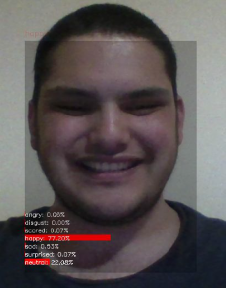
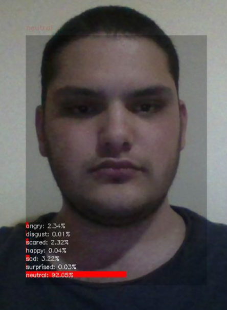
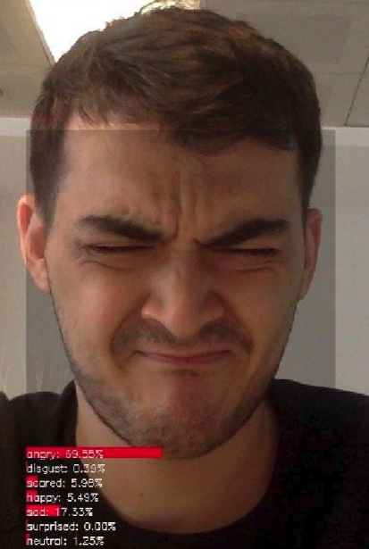
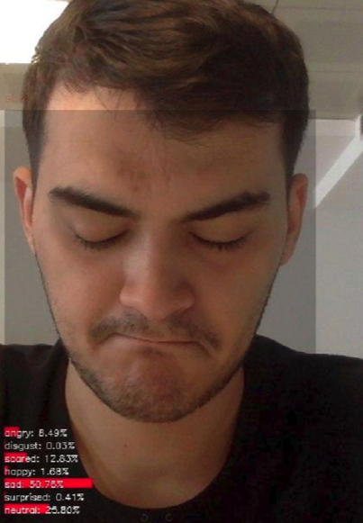

## REAL-TIME EMOTION RECOGNITION with CNN MODEL (KDEF training on FER2013 )

#### Graduation Project at Namık Kemal University

We created Real-time emotion recognition application with Yusuf Alper Sarı.

In this study; a CNN model is trained to be used in real-time emotion recognition. The model was created using the dataset FER2013 and then fine tuned with KDEF dataset. Tests were made on the last version of the model and the highest performance was used in real-time emotion recognition.

<table><tr><td align="center"><a href="https://github.com/umit-ozturk">  <b>Ümit Öztürk</b></a> </td><td align="center"><a href="https://github.com/yusufalper">  <b>Yusuf Alper Sarı</b></a> </td></tr></table>  

## Installation
Clone the repository and create a virtual environment.

    $ git clone https://github.com/umit-ozturk/Final-Project-with-CNN.git
	$ cd Final-Project-with-CNN
	$ virtualenv -p python3 env
	$ source env/bin/activate
    $ pip install -r requirements.txt
    $ cd src
    
## Run Application
    
    $ python new_real_time.py

## Screenshots

